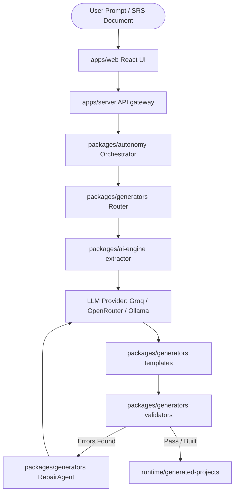

# 📎 Paperclip Core

Paperclip Core is an autonomous, multi-agent code generation platform designed to build, compile, validate, and repair complex web applications. By utilizing structured agent pipelines, Paperclip Core translates plain-text descriptions or detailed Software Requirement Specifications (SRS) into functional full-stack projects with databases, APIs, and client dashboards.

---

## 🏗️ Architecture

Paperclip Core operates as a monorepo consisting of dedicated workspace packages and applications:



### Key Modules:
- **`apps/web`**: The main React + Vite frontend dashboard where users view project statuses, manage files, and interact with live preview processes.
- **`apps/server`**: The gateway API that handles generation requests, tracks active processes, and manages the project registry database.
- **`packages/ai-engine`**: Integrates Groq, OpenRouter, and Ollama clients for schema extraction and code writing.
- **`packages/generators`**: The templating engine, route classification, and validator suite (AST parsing, React tree structure, and functional verification).
- **`packages/autonomy`**: Orchestrates pipelines, captures execution checkpoints, and manages automated recovery loops.
- **`packages/db`**: Global database configurations, schemas, and migrations.

---

## ✨ Features

- **Dynamic Pipeline Routing**: Auto-detects app classification (e.g. `crud-admin`, `frontend-app`, `hybrid-fullstack`) and adjusts templates accordingly.
- **Self-Healing Loop (RepairAgent)**: Validates code using AST engines and React structure validators. If compile errors rise, it auto-snapshots the workspace, rolls back if errors increase, and logs repair actions.
- **Semantic Placeholder Detection**: Scans and blocks placeholder UI cards, "Coming Soon" sections, and mock-up variables to ensure generated apps have fully functional, working components.
- **Full-Stack previewing**: Dynamically spins up generated application backends and frontends on offset isolated ports (e.g. `3001` and `5175`).

---

## 💻 Technology Stack

- **Monorepo Manager**: `pnpm` workspace + Vercel Turborepo
- **Frontend**: React, TypeScript, TailwindCSS, Vite, Lucide icons, Zustand (state)
- **Backend**: Node.js, Express, ts-node-dev
- **AI Integrations**: Llama 3 via Groq (default), OpenRouter, Ollama
- **Database (Generated)**: Prisma ORM, PostgreSQL / SQLite

---

## 🛠️ Setup Instructions

### Prerequisites
- Node.js (v22+)
- `pnpm` (v9+)
- PostgreSQL (if running full-stack CRUD generators)

### Installation
1. Clone the repository:
   ```bash
   git clone https://github.com/your-username/paperclip-core.git
   cd paperclip-core
   ```
2. Install monorepo dependencies:
   ```bash
   pnpm install
   ```
3. Set up environment configurations:
   ```bash
   cp .env.example .env
   ```
   *Edit `.env` to add your `GROQ_API_KEY` or other LLM API credentials.*

4. Run the development environment:
   ```bash
   pnpm run dev
   ```
   The backend server will run on port `3000` and the main dashboard UI will be hosted at `http://localhost:5174`.

---

## 📂 Folder Structure

```
paperclip-core/
├── agents/                  # [Placeholder] AI Agent templates
├── apps/
│   ├── server/              # Express API Server
│   └── web/                 # React UI Client
├── docs/
│   ├── architecture/        # System design & API documentations
│   ├── integrations/        # LLM integration guides
│   └── reports/             # Reliability & system stabilization reports
├── packages/
│   ├── ai-engine/           # LLM connector and parsing logic
│   ├── autonomy/            # Pipelines & checkpoints
│   ├── db/                  # Prisma schemas & DB configuration
│   ├── frontend-intelligence/# Compiler heuristics and fallback code engines
│   ├── generators/          # Code templating and validation suite
│   └── shared/              # Global models & shared utilities
├── runtime/                 # Runtime generated projects, temp, and logs
├── docker/                  # Docker compose development databases
└── scratch/                 # Local diagnostic and verification scripts
```

---

## 🔌 Environment Variables

| Variable | Default | Purpose |
| :--- | :--- | :--- |
| `PORT` | `3000` | Port of the main Express server |
| `AI_PROVIDER` | `groq` | Selected AI LLM provider (`groq`, `openrouter`, `ollama`) |
| `GROQ_API_KEY` | - | API key for Groq Cloud services |
| `GROQ_MODEL` | `llama-3.3-70b-versatile` | Main Groq code generator model |
| `OPENROUTER_API_KEY`| - | API key for OpenRouter integrations |
| `OLLAMA_API_URL` | `http://localhost:11434` | Endpoint of your local Ollama server |
| `DATABASE_URL` | - | PostgreSQL connection URL |

---

## 🛣️ Future Roadmap

- **Autonomous Agent Expansion**: Migrate generator logic to separate, fully containerized agent microservices under the `/agents` directory.
- **Multimodal Visual Verification**: Capture preview screenshots and feed them to vision LLMs to confirm UI layouts match user requirements.
- **Kubernetes Sandboxing**: Deploy generated projects inside temporary Kubernetes pods rather than local processes to guarantee execution sandboxing.

---

## 🤝 Contributing

We welcome pull requests to improve the validation engine, expand templates, or add providers. Please ensure `pnpm run build` compiles successfully and all validators pass before opening a PR.

---

## 📄 License

This project is licensed under the MIT License. See `LICENSE` for more details.
