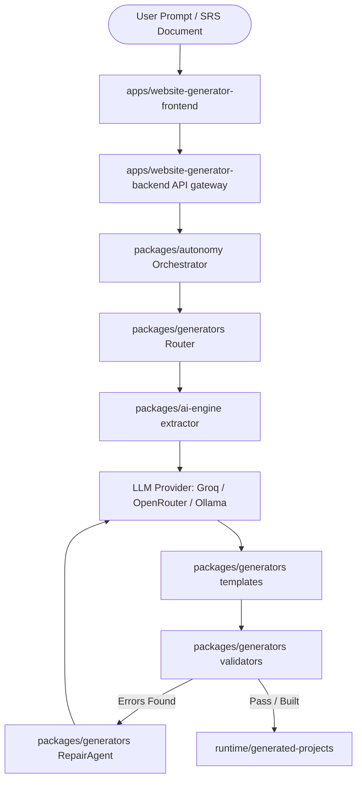

<div align="center">
  
  
  # Website Generator Core
  
  **An autonomous, multi-agent code generation platform designed to build, compile, validate, and repair complex web applications from plain-text descriptions.**
  
  [](https://opensource.org/licenses/MIT)
  [](https://www.typescriptlang.org/)
  [](https://nodejs.org)
  [](https://pnpm.io/)
  [](https://turbo.build/)

  <br />
</div>

---

## 🌟 Overview

Website Generator Core translates plain-text descriptions or detailed Software Requirement Specifications (SRS) into **functional, full-stack projects**. By utilizing structured agent pipelines, the system generates databases, API gateways, and fully-featured client dashboards iteratively, ensuring a high-quality end product through self-healing compiler loops.

## 🏗️ Architecture

Website Generator Core operates as a highly modular monorepo consisting of dedicated workspace packages and applications:



### 📦 Key Modules
- **`apps/website-generator-frontend`**: The React + Vite frontend dashboard where users view project statuses, manage files, and interact with live previews.
- **`apps/website-generator-backend`**: The Express API gateway that handles generation requests, tracks active processes, and manages the project registry database.
- **`packages/ai-engine`**: Integrates Groq, OpenRouter, and Ollama clients for schema extraction and code generation.
- **`packages/generators`**: The templating engine, route classification, and validator suite (AST parsing, React tree structure, and functional verification).
- **`packages/autonomy`**: Orchestrates pipelines, captures execution checkpoints, and manages automated recovery loops.
- **`packages/db`**: Global database configurations, schemas, and migrations.

---

## ✨ Core Features

- 🧠 **Dynamic Pipeline Routing**: Auto-detects app classification (e.g. `crud-admin`, `frontend-app`, `hybrid-fullstack`) and routes prompts through specialized templates.
- 🩹 **Self-Healing Loop (RepairAgent)**: Validates code using AST engines and React structure validators. It auto-snapshots the workspace, rolls back if compilation errors increase, and continuously repairs broken components.
- 🚫 **Semantic Placeholder Detection**: Scans and blocks placeholder UI cards, "Coming Soon" text, and mock-up variables to guarantee functional outputs.
- 🚀 **Full-Stack Previewing**: Dynamically spins up generated application backends and frontends on offset isolated ports for instant testing (e.g., `3001` and `5175`).

---

## 💻 Technology Stack

| Domain | Technologies |
| :--- | :--- |
| **Monorepo Manager** | `pnpm` workspace + Vercel Turborepo |
| **Frontend UI** | React, TypeScript, TailwindCSS, Vite, Zustand |
| **Backend API** | Node.js, Express, `ts-node-dev` |
| **AI Integrations** | Groq (Llama 3), OpenRouter, Ollama |
| **Database** | Prisma ORM, PostgreSQL, SQLite |

---

## 🛠️ Quick Start

### Prerequisites
- [Node.js](https://nodejs.org) (v22+)
- [pnpm](https://pnpm.io/installation) (v9+)
- PostgreSQL (if running full-stack CRUD generators)

### 1. Installation

Clone the repository and install the monorepo dependencies:
```bash
git clone https://github.com/your-username/website-generator-core.git
cd website-generator-core
pnpm install
```

### 2. Configuration

Set up environment configurations:
```bash
cp .env.example .env
```
*Be sure to edit `.env` to add your `GROQ_API_KEY` or preferred LLM API credentials.*

### 3. Running the Platform

Run the development environment from the root directory:
```bash
pnpm run dev
```
The backend server will run on port `3000` and the main dashboard UI will be hosted at `http://localhost:5174`.

---

## 📂 Project Structure

```text
website-generator-core/
├── agents/                  # AI Agent system templates
├── apps/                    # Core executable applications
│   ├── website-generator-backend/   
│   └── website-generator-frontend/  
├── docs/                    # Architecture, reports & diagnostics
│   ├── architecture/        
│   ├── integrations/        
│   └── reports/             
├── packages/                # Shared workspace libraries
│   ├── ai-engine/           
│   ├── autonomy/            
│   ├── db/                  
│   ├── frontend-intelligence/
│   ├── generators/          
│   └── shared/              
├── runtime/                 # Target for generated projects & logs
├── docker/                  # Docker compose development databases
└── scratch/                 # Local diagnostic and verification scripts
```

---

## 🔌 Environment Variables

| Variable | Default | Purpose |
| :--- | :--- | :--- |
| `PORT` | `3000` | Port of the main Express server |
| `AI_PROVIDER` | `groq` | Selected AI LLM provider (`groq`, `openrouter`, `ollama`) |
| `GROQ_API_KEY` | - | API key for Groq Cloud services |
| `GROQ_MODEL` | `llama-3.3-70b-versatile` | Main Groq code generator model |
| `OPENROUTER_API_KEY`| - | API key for OpenRouter integrations |
| `OLLAMA_API_URL` | `http://localhost:11434` | Endpoint of your local Ollama server |
| `DATABASE_URL` | - | PostgreSQL connection URL |

---

## 🤝 Contributing

We welcome pull requests to improve the validation engine, expand templates, or add providers. 

1. Create a new branch for your feature.
2. Run `pnpm run lint` and ensure there are no errors.
3. Ensure `pnpm run build` compiles successfully and all validators pass before opening a PR.

## 📄 License

This project is licensed under the MIT License. See `LICENSE` for more details.
